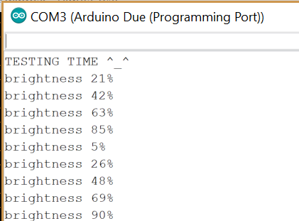
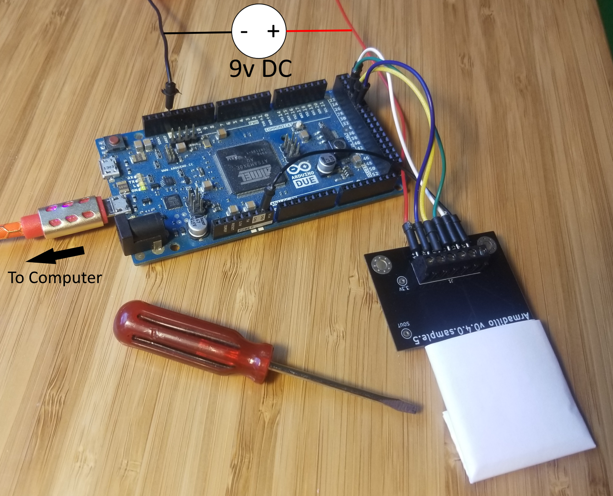
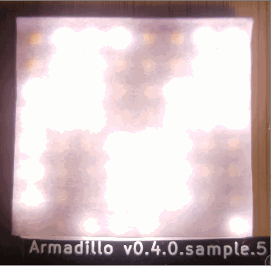

Test the Armadillo PCB v0.4.1

## Product Profile

The Armadillo PCB is an LED matrix with individually-addressable pixels and high refresh rate. It is controlled by serial (CLK and SIN pins) with latch (LAT pin). It has two operating modes: Dot Correction Mode and On/Off Mode (MOD pin).

## General Test Procedure

1. Flash Arduino with provided code
2. Verify light pattern

## Tools

* Computer (Linux, Windows, or Mac)
* Arduino Due
* Micro USB Cable
* 9v DC Power Supply
* Printer paper (2 sheets)

## Procedure

1. The LEDs are very bright. Cover them with at least 2 sheets of printer paper to **protect your eyes**.
3. Download and install [Arduino IDE](https://www.arduino.cc/en/Main/Software)
2. Use micro USB cable to connect the computer to the Arduino Due's **programming port** (located in the center, between USB peripheral port and barrel connector).
4. Inside Arduino IDE...
    1. When prompted, install Arduino Due software [`Arduino SAM Boards`](https://www.arduino.cc/en/Guide/ArduinoDue#toc2).
    2. Open `armadillo-pcb-test.ino` from this repository.
    3. Select Tools > Board > `Arduino Due (Programming Port)`.
    4. Select Tools > Port > COM# (for example, COM3). Normally only one COM is shown.
    5. Click Upload. Make sure it is **successful**.
    6. Go to Tools > Serial Monitor. Expect output:  
5. Connect 9v DC power supply negative (-) to Arduino GND.
6. Connect all 6 positions of PCB's J1 terminal block:
    - GND: Arduino GND (there are 3 total)
    - CLK: Arduino 26
    - SIN: Arduino 28
    - LAT: Arduino 30
    - MOD: Arduino 32
    - +9V: 9v DC power supply positive (+)
    
7. Turn on 9v DC power supply. Look for the snake pattern across all LEDs. Expect brightness to cycle every second. 
